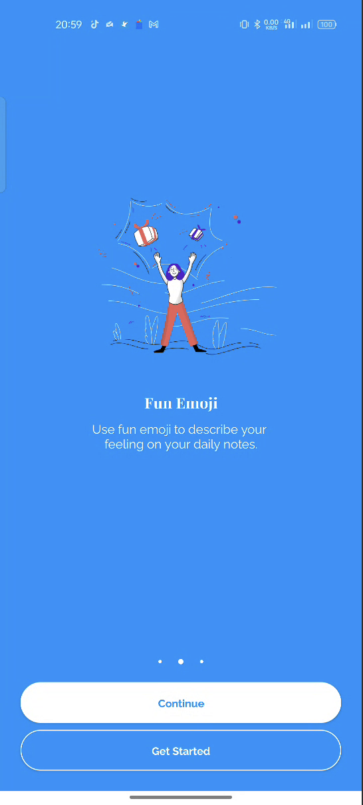

# LifeLog Onboarding Optimizations

## Current State
The current onboarding flow consists of:
- ViewPager with 3 screens and indicator dots
- Two buttons on each screen: "Continue" and "Get Started"
- Only shown on first app install

## Proposed Improvements

### Content Recommendations

#### Screen 1 
- **Title**: "Write Daily Log"
- **Subtitle**: "Write your activity everyday, then read it later as good memories."
- **Illustration**: Person with whiteboard 

#### Screen 2 
- **Title**: "Fun Emoji"
- **Subtitle**: "Use fun emoji to describe your feelin on you daily notes."
- **Illustration**: Person interacting with mood icons/chart

#### Screen 3
- **Title**: "Trace Activity"
- **Subtitle**: "By writing your activities, you can trace your best memories."
- **Illustration**: Person looking at highlighted calendar or browsing entries
